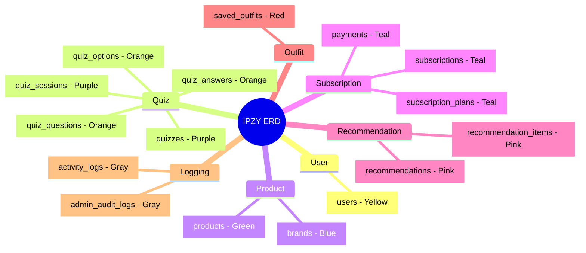

# 01. 도메인별 색상 구분

## 테이블 분류

## 색상 범례

| 색상 | 도메인 | 테이블 수 |
|------|--------|----------|
| Yellow | User | 1 |
| Purple | Quiz Core | 2 |
| Orange | Quiz Detail | 3 |
| Blue | Brand | 1 |
| Green | Product | 1 |
| Teal | Subscription | 3 |
| Pink | Recommendation | 2 |
| Red | Outfit | 1 |
| Gray | Logging | 2 |
| **Total** | | **16** |
