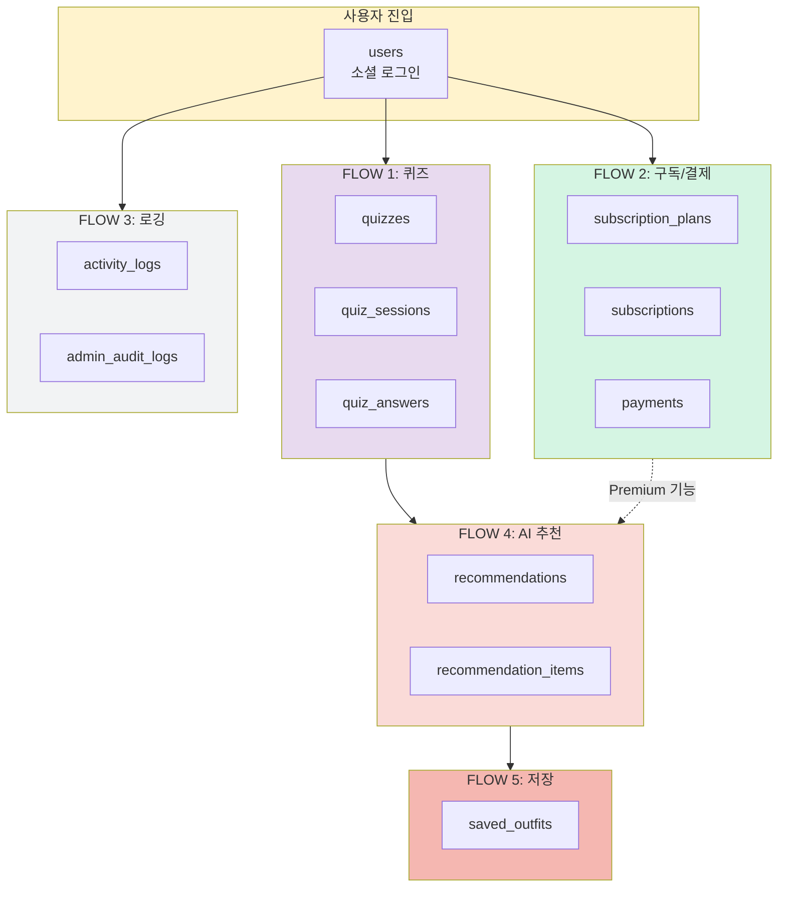

# 02. 핵심 비즈니스 플로우

## 전체 서비스 흐름


```mermaid
flowchart TB
    subgraph USER["사용자 진입"]
        U[users<br/>소셜 로그인]
    end

    subgraph FLOW1["FLOW 1: 퀴즈"]
        Q[quizzes]
        QS[quiz_sessions]
        QA[quiz_answers]
    end

    subgraph FLOW2["FLOW 2: 구독/결제"]
        SP[subscription_plans]
        S[subscriptions]
        P[payments]
    end

    subgraph FLOW3["FLOW 3: 로깅"]
        AL[activity_logs]
        AAL[admin_audit_logs]
    end

    subgraph FLOW4["FLOW 4: AI 추천"]
        R[recommendations]
        RI[recommendation_items]
    end

    subgraph FLOW5["FLOW 5: 저장"]
        SO[saved_outfits]
    end

    U --> FLOW1
    U --> FLOW2
    U --> FLOW3

    FLOW1 --> FLOW4
    FLOW2 -.->|Premium 기능| FLOW4
    FLOW4 --> FLOW5

    style USER fill:#fff3cd
    style FLOW1 fill:#e8daef
    style FLOW2 fill:#d5f5e3
    style FLOW3 fill:#f2f3f4
    style FLOW4 fill:#fadbd8
    style FLOW5 fill:#f5b7b1
```

## 사용자 여정 요약

```
로그인 → 퀴즈 진행 → AI 추천 받기 → 코디 저장 → (구독 시) 더 많은 추천
```
