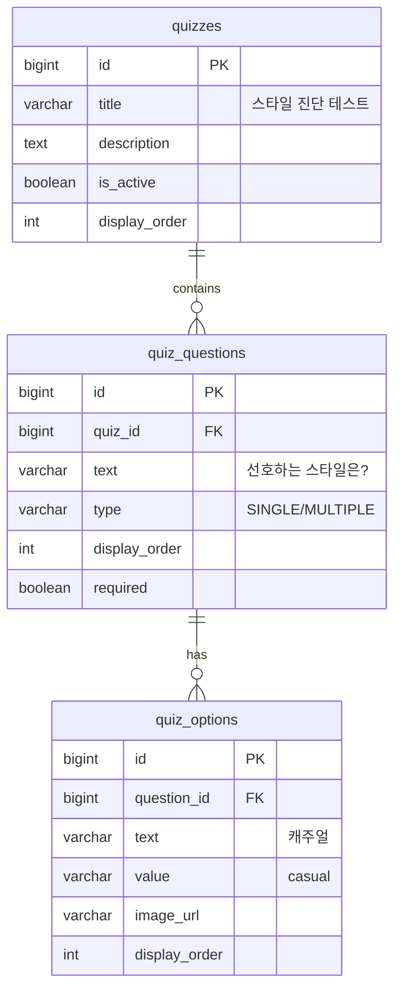
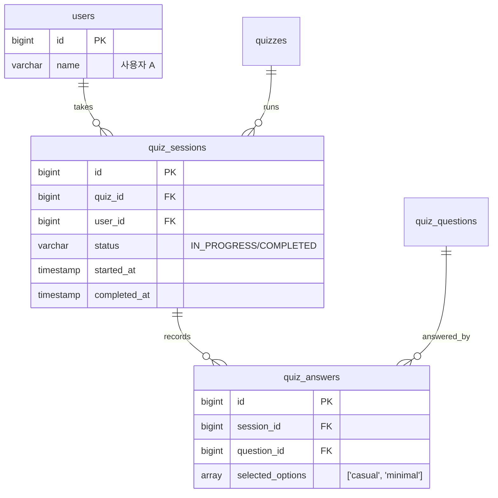
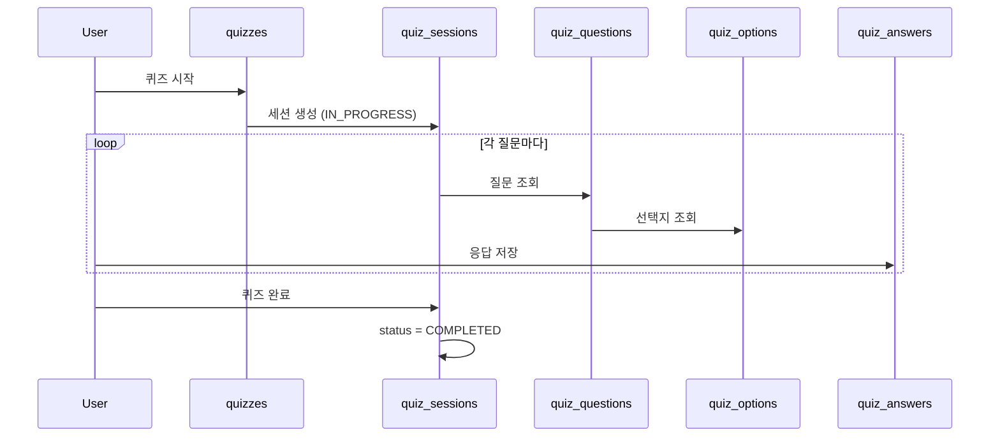

# 03. 스타일 퀴즈 플로우

## 정적 데이터 (관리자 설정)

```mermaid
erDiagram
    quizzes ||--o{ quiz_questions : contains
    quiz_questions ||--o{ quiz_options : has

    quizzes {
        bigint id PK
        varchar title "스타일 진단 테스트"
        text description
        boolean is_active
        int display_order
    }

    quiz_questions {
        bigint id PK
        bigint quiz_id FK
        varchar text "선호하는 스타일은?"
        varchar type "SINGLE/MULTIPLE"
        int display_order
        boolean required
    }

    quiz_options {
        bigint id PK
        bigint question_id FK
        varchar text "캐주얼"
        varchar value "casual"
        varchar image_url
        int display_order
    }
```

## 동적 데이터 (사용자 진행)

```mermaid
erDiagram
    users ||--o{ quiz_sessions : takes
    quizzes ||--o{ quiz_sessions : runs
    quiz_sessions ||--o{ quiz_answers : records
    quiz_questions ||--o{ quiz_answers : answered_by

    users {
        bigint id PK
        varchar name "사용자 A"
    }

    quiz_sessions {
        bigint id PK
        bigint quiz_id FK
        bigint user_id FK
        varchar status "IN_PROGRESS/COMPLETED"
        timestamp started_at
        timestamp completed_at
    }

    quiz_answers {
        bigint id PK
        bigint session_id FK
        bigint question_id FK
        array selected_options "['casual', 'minimal']"
    }
```

## 플로우 순서

```mermaid
sequenceDiagram
    participant U as User
    participant QZ as quizzes
    participant QS as quiz_sessions
    participant QQ as quiz_questions
    participant QO as quiz_options
    participant QA as quiz_answers

    U->>QZ: 퀴즈 시작
    QZ->>QS: 세션 생성 (IN_PROGRESS)

    loop 각 질문마다
        QS->>QQ: 질문 조회
        QQ->>QO: 선택지 조회
        U->>QA: 응답 저장
    end

    U->>QS: 퀴즈 완료
    QS->>QS: status = COMPLETED
```
