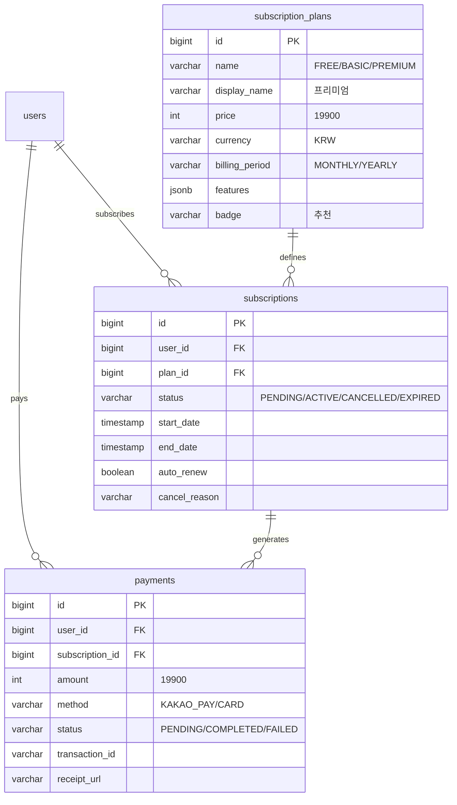
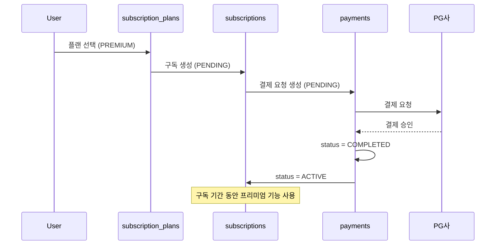
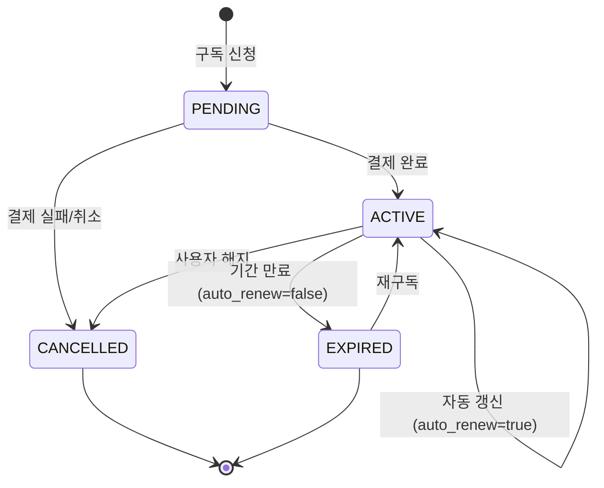

# 04. 구독 & 결제 플로우

## ERD

```mermaid
erDiagram
    users ||--o{ subscriptions : subscribes
    subscription_plans ||--o{ subscriptions : defines
    users ||--o{ payments : pays
    subscriptions ||--o{ payments : generates

    subscription_plans {
        bigint id PK
        varchar name "FREE/BASIC/PREMIUM"
        varchar display_name "프리미엄"
        int price "19900"
        varchar currency "KRW"
        varchar billing_period "MONTHLY/YEARLY"
        jsonb features
        varchar badge "추천"
    }

    subscriptions {
        bigint id PK
        bigint user_id FK
        bigint plan_id FK
        varchar status "PENDING/ACTIVE/CANCELLED/EXPIRED"
        timestamp start_date
        timestamp end_date
        boolean auto_renew
        varchar cancel_reason
    }

    payments {
        bigint id PK
        bigint user_id FK
        bigint subscription_id FK
        int amount "19900"
        varchar method "KAKAO_PAY/CARD"
        varchar status "PENDING/COMPLETED/FAILED"
        varchar transaction_id
        varchar receipt_url
    }
```

## 결제 플로우

```mermaid
sequenceDiagram
    participant U as User
    participant SP as subscription_plans
    participant S as subscriptions
    participant P as payments
    participant PG as PG사

    U->>SP: 플랜 선택 (PREMIUM)
    SP->>S: 구독 생성 (PENDING)
    S->>P: 결제 요청 생성 (PENDING)

    P->>PG: 결제 요청
    PG-->>P: 결제 승인

    P->>P: status = COMPLETED
    P->>S: status = ACTIVE

    Note over S: 구독 기간 동안 프리미엄 기능 사용
```

## 구독 상태 전이

```mermaid
stateDiagram-v2
    [*] --> PENDING: 구독 신청
    PENDING --> ACTIVE: 결제 완료
    PENDING --> CANCELLED: 결제 실패/취소
    ACTIVE --> CANCELLED: 사용자 해지
    ACTIVE --> EXPIRED: 기간 만료 (auto_renew=false)
    ACTIVE --> ACTIVE: 자동 갱신 (auto_renew=true)
    EXPIRED --> ACTIVE: 재구독
    CANCELLED --> [*]
    EXPIRED --> [*]
```
