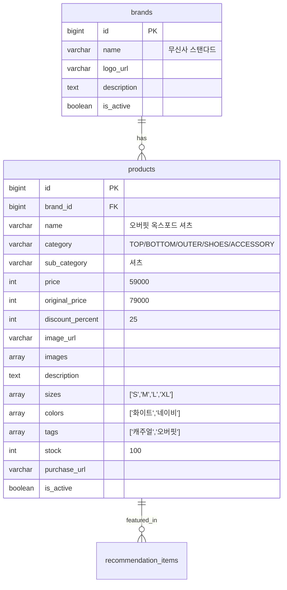
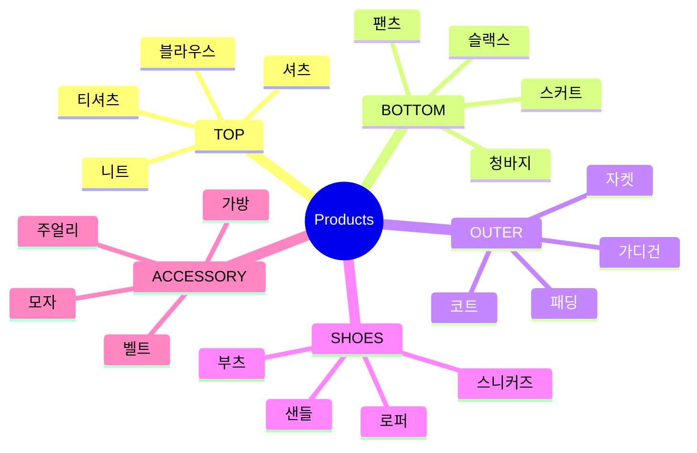
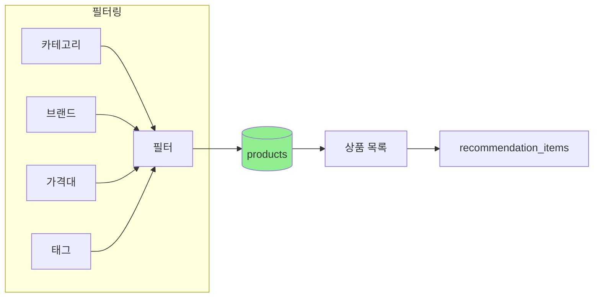

# 05. 상품 카탈로그 플로우

## ERD

```mermaid
erDiagram
    brands ||--o{ products : has
    products ||--o{ recommendation_items : featured_in

    brands {
        bigint id PK
        varchar name "무신사 스탠다드"
        varchar logo_url
        text description
        boolean is_active
    }

    products {
        bigint id PK
        bigint brand_id FK
        varchar name "오버핏 옥스포드 셔츠"
        varchar category "TOP/BOTTOM/OUTER/SHOES/ACCESSORY"
        varchar sub_category "셔츠"
        int price "59000"
        int original_price "79000"
        int discount_percent "25"
        varchar image_url
        array images
        text description
        array sizes "['S','M','L','XL']"
        array colors "['화이트','네이비']"
        array tags "['캐주얼','오버핏']"
        int stock "100"
        varchar purchase_url
        boolean is_active
    }
```

## 카테고리 구조

```mermaid
mindmap
  root((Products))
    TOP
      셔츠
      티셔츠
      니트
      블라우스
    BOTTOM
      팬츠
      슬랙스
      청바지
      스커트
    OUTER
      자켓
      코트
      패딩
      가디건
    SHOES
      스니커즈
      로퍼
      부츠
      샌들
    ACCESSORY
      가방
      모자
      벨트
      주얼리
```

## 상품 조회 플로우

```mermaid
flowchart LR
    subgraph 필터링
        A[카테고리] --> F[필터]
        B[브랜드] --> F
        C[가격대] --> F
        D[태그] --> F
    end

    F --> P[(products)]
    P --> R[상품 목록]

    R --> RI[recommendation_items]

    style P fill:#90EE90
```
