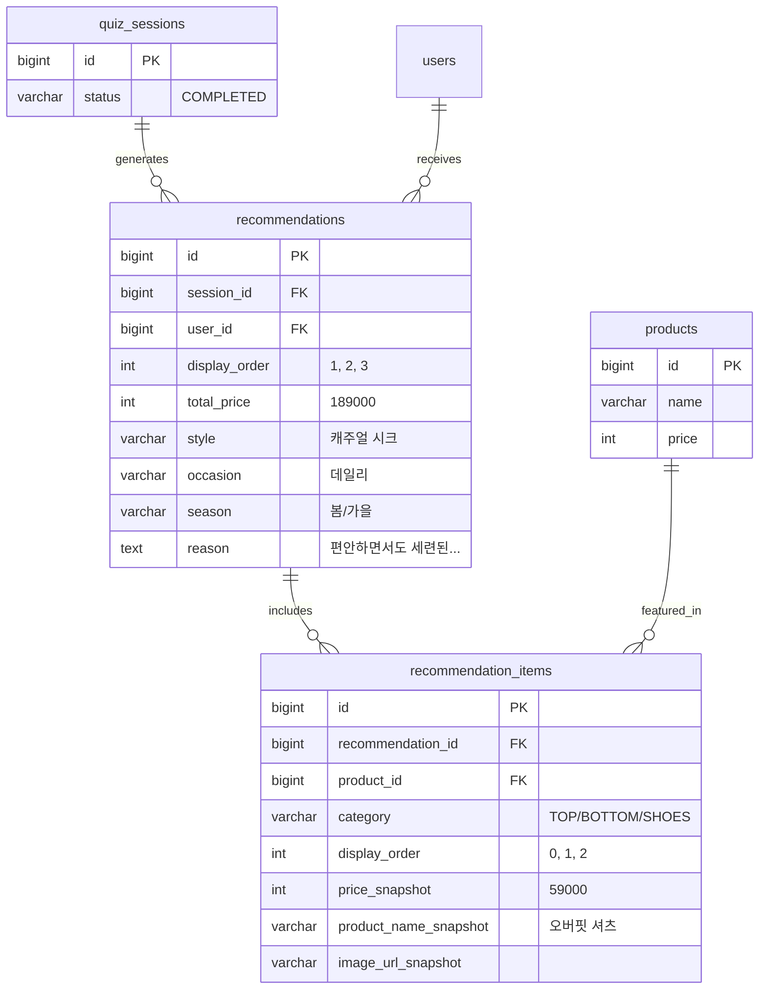
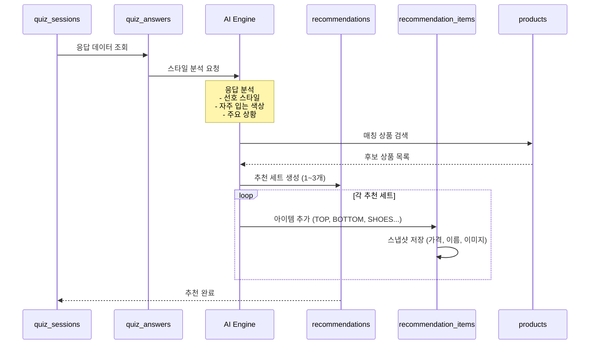
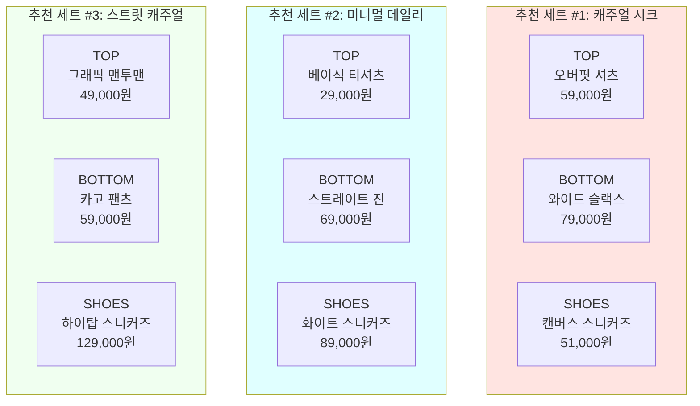
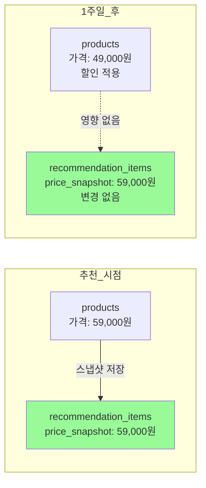

# 06. AI 추천 플로우

## ERD

```mermaid
erDiagram
    quiz_sessions ||--o{ recommendations : generates
    users ||--o{ recommendations : receives
    recommendations ||--o{ recommendation_items : includes
    products ||--o{ recommendation_items : featured_in

    quiz_sessions {
        bigint id PK
        varchar status "COMPLETED"
    }

    recommendations {
        bigint id PK
        bigint session_id FK
        bigint user_id FK
        int display_order "1, 2, 3"
        int total_price "189000"
        varchar style "캐주얼 시크"
        varchar occasion "데일리"
        varchar season "봄/가을"
        text reason "편안하면서도 세련된..."
    }

    recommendation_items {
        bigint id PK
        bigint recommendation_id FK
        bigint product_id FK
        varchar category "TOP/BOTTOM/SHOES"
        int display_order "0, 1, 2"
        int price_snapshot "59000"
        varchar product_name_snapshot "오버핏 셔츠"
        varchar image_url_snapshot
    }

    products {
        bigint id PK
        varchar name
        int price
    }
```

## AI 추천 프로세스

```mermaid
sequenceDiagram
    participant QS as quiz_sessions
    participant QA as quiz_answers
    participant AI as AI Engine
    participant R as recommendations
    participant RI as recommendation_items
    participant P as products

    QS->>QA: 응답 데이터 조회
    QA->>AI: 스타일 분석 요청

    Note over AI: 응답 분석<br/>- 선호 스타일<br/>- 자주 입는 색상<br/>- 주요 상황

    AI->>P: 매칭 상품 검색
    P-->>AI: 후보 상품 목록

    AI->>R: 추천 세트 생성 (1~3개)

    loop 각 추천 세트
        AI->>RI: 아이템 추가 (TOP, BOTTOM, SHOES...)
        RI->>RI: 스냅샷 저장 (가격, 이름, 이미지)
    end

    R-->>QS: 추천 완료
```

## 추천 구성 예시

```mermaid
flowchart TB
    subgraph REC1["추천 세트 #1: 캐주얼 시크"]
        direction LR
        T1[TOP<br/>오버핏 셔츠<br/>59,000원]
        B1[BOTTOM<br/>와이드 슬랙스<br/>79,000원]
        S1[SHOES<br/>캔버스 스니커즈<br/>51,000원]
    end

    subgraph REC2["추천 세트 #2: 미니멀 데일리"]
        direction LR
        T2[TOP<br/>베이직 티셔츠<br/>29,000원]
        B2[BOTTOM<br/>스트레이트 진<br/>69,000원]
        S2[SHOES<br/>화이트 스니커즈<br/>89,000원]
    end

    subgraph REC3["추천 세트 #3: 스트릿 캐주얼"]
        direction LR
        T3[TOP<br/>그래픽 맨투맨<br/>49,000원]
        B3[BOTTOM<br/>카고 팬츠<br/>59,000원]
        S3[SHOES<br/>하이탑 스니커즈<br/>129,000원]
    end

    style REC1 fill:#FFE4E1
    style REC2 fill:#E0FFFF
    style REC3 fill:#F0FFF0
```

## 스냅샷 패턴

```mermaid
flowchart LR
    subgraph 추천_시점
        P1[products<br/>가격: 59,000원]
        RI1[recommendation_items<br/>price_snapshot: 59,000원]
    end

    subgraph 1주일_후
        P2[products<br/>가격: 49,000원<br/>할인 적용]
        RI2[recommendation_items<br/>price_snapshot: 59,000원<br/>변경 없음]
    end

    P1 -->|스냅샷 저장| RI1
    P2 -.->|영향 없음| RI2

    style RI1 fill:#98FB98
    style RI2 fill:#98FB98
```
