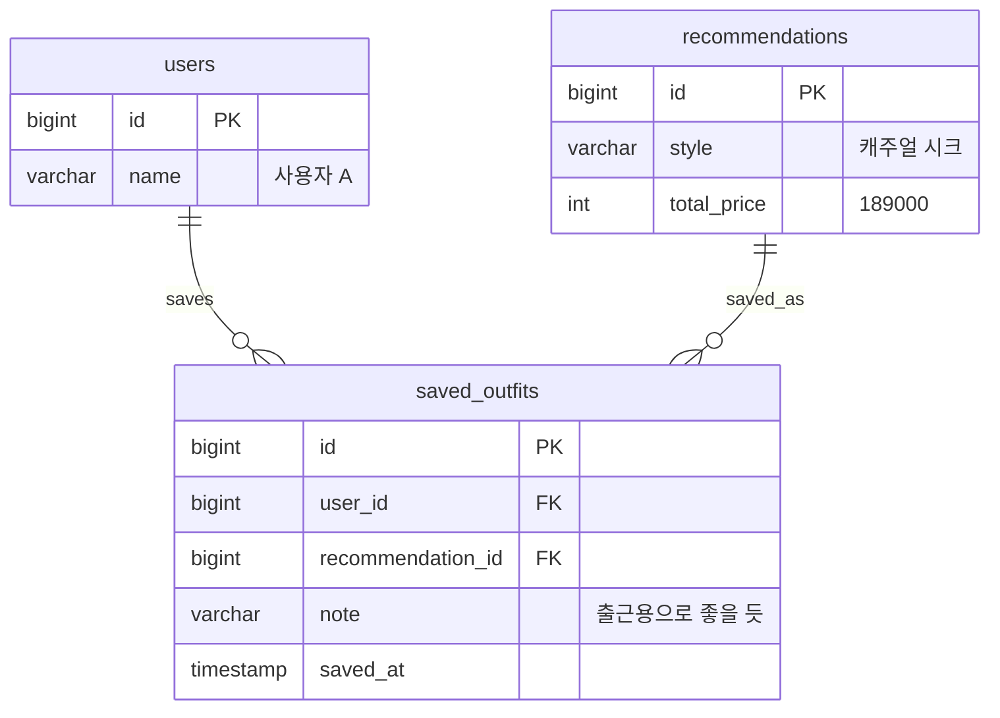
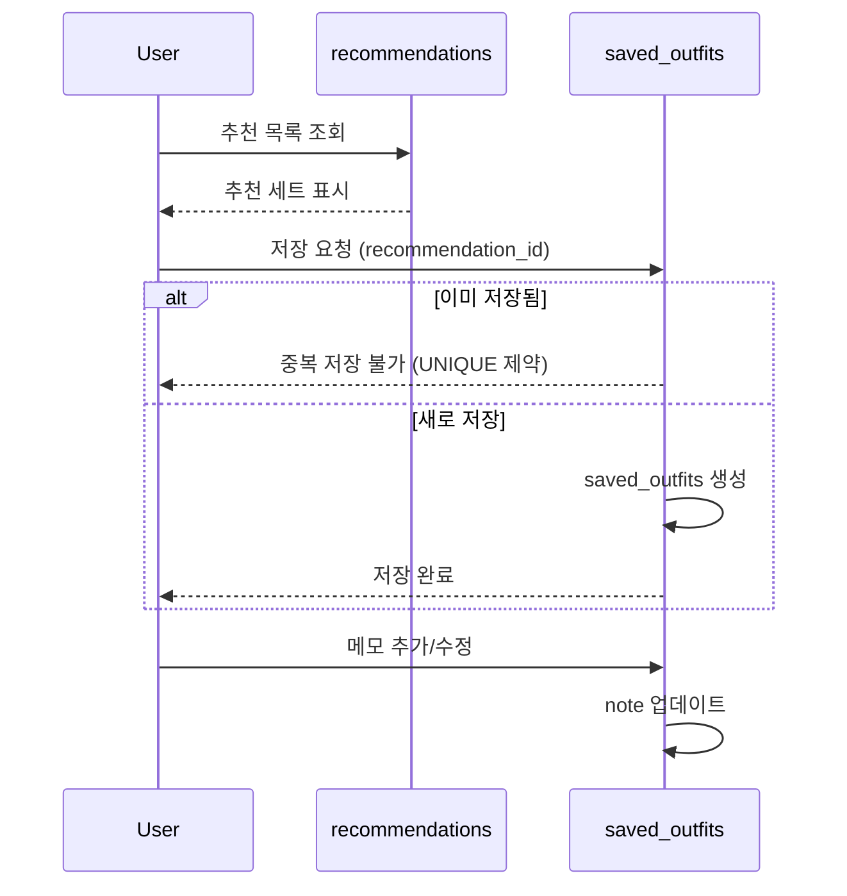
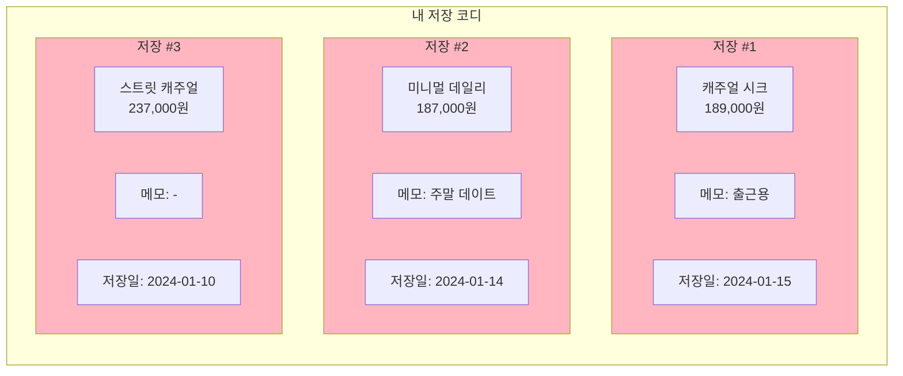
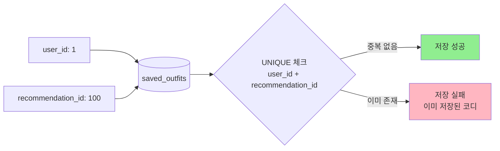

# 07. 코디 저장 플로우

## ERD

```mermaid
erDiagram
    users ||--o{ saved_outfits : saves
    recommendations ||--o{ saved_outfits : saved_as

    users {
        bigint id PK
        varchar name "사용자 A"
    }

    saved_outfits {
        bigint id PK
        bigint user_id FK
        bigint recommendation_id FK
        varchar note "출근용으로 좋을 듯"
        timestamp saved_at
    }

    recommendations {
        bigint id PK
        varchar style "캐주얼 시크"
        int total_price "189000"
    }
```

## 저장 플로우

```mermaid
sequenceDiagram
    participant U as User
    participant R as recommendations
    participant SO as saved_outfits

    U->>R: 추천 목록 조회
    R-->>U: 추천 세트 표시

    U->>SO: 저장 요청 (recommendation_id)

    alt 이미 저장됨
        SO-->>U: 중복 저장 불가 (UNIQUE 제약)
    else 새로 저장
        SO->>SO: saved_outfits 생성
        SO-->>U: 저장 완료
    end

    U->>SO: 메모 추가/수정
    SO->>SO: note 업데이트
```

## 저장 목록 조회

```mermaid
flowchart TB
    subgraph 사용자_저장목록["내 저장 코디"]
        direction TB

        subgraph S1["저장 #1"]
            R1[캐주얼 시크<br/>189,000원]
            N1[메모: 출근용]
            D1[저장일: 2024-01-15]
        end

        subgraph S2["저장 #2"]
            R2[미니멀 데일리<br/>187,000원]
            N2[메모: 주말 데이트]
            D2[저장일: 2024-01-14]
        end

        subgraph S3["저장 #3"]
            R3[스트릿 캐주얼<br/>237,000원]
            N3[메모: -]
            D3[저장일: 2024-01-10]
        end
    end

    style S1 fill:#FFB6C1
    style S2 fill:#FFB6C1
    style S3 fill:#FFB6C1
```

## UNIQUE 제약조건

```mermaid
flowchart LR
    U[user_id: 1] --> SO[(saved_outfits)]
    R[recommendation_id: 100] --> SO

    SO --> C{UNIQUE 체크<br/>user_id + recommendation_id}

    C -->|중복 없음| OK[저장 성공]
    C -->|이미 존재| ERR[저장 실패<br/>이미 저장된 코디]

    style OK fill:#90EE90
    style ERR fill:#FFB6C1
```
