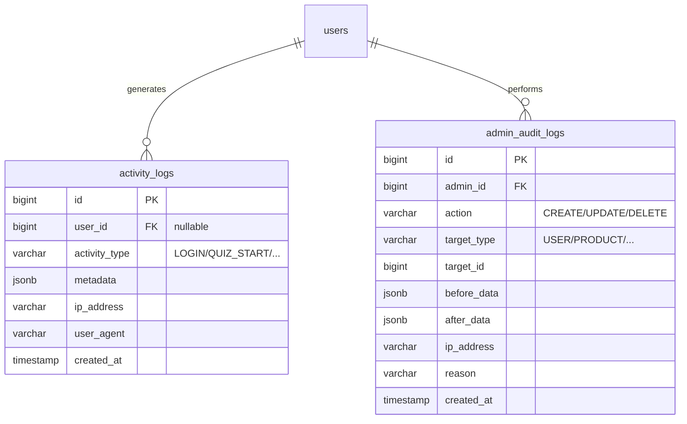
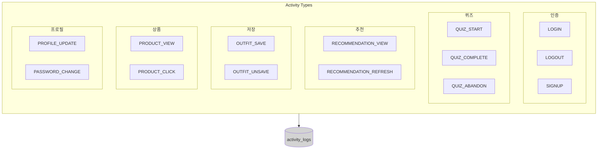
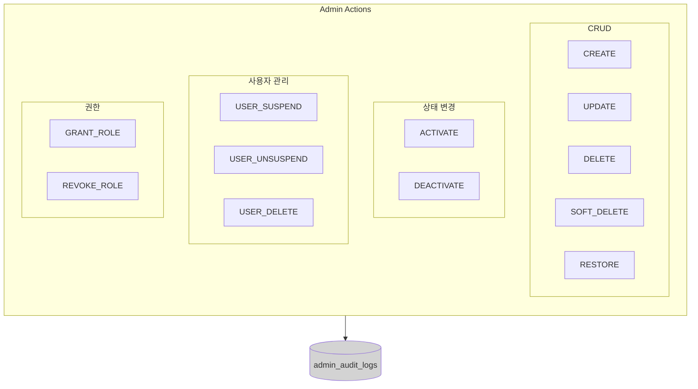
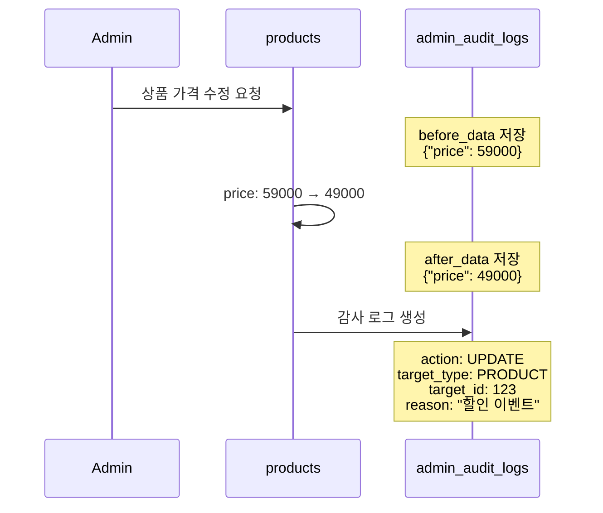

# 08. 로깅 플로우

## ERD



## 사용자 활동 로그



## 관리자 감사 로그



## 감사 로그 상세 예시



## 로그 데이터 예시

### activity_logs

```json
{
  "id": 1,
  "user_id": 100,
  "activity_type": "QUIZ_COMPLETE",
  "metadata": {
    "quiz_id": 1,
    "session_id": 50,
    "duration_seconds": 180
  },
  "ip_address": "192.168.1.1",
  "user_agent": "Mozilla/5.0...",
  "created_at": "2024-01-15T10:30:00"
}
```

### admin_audit_logs

```json
{
  "id": 1,
  "admin_id": 1,
  "action": "UPDATE",
  "target_type": "PRODUCT",
  "target_id": 123,
  "before_data": {"price": 59000, "is_active": true},
  "after_data": {"price": 49000, "is_active": true},
  "ip_address": "10.0.0.1",
  "reason": "연말 할인 이벤트 적용",
  "created_at": "2024-01-15T09:00:00"
}
```
