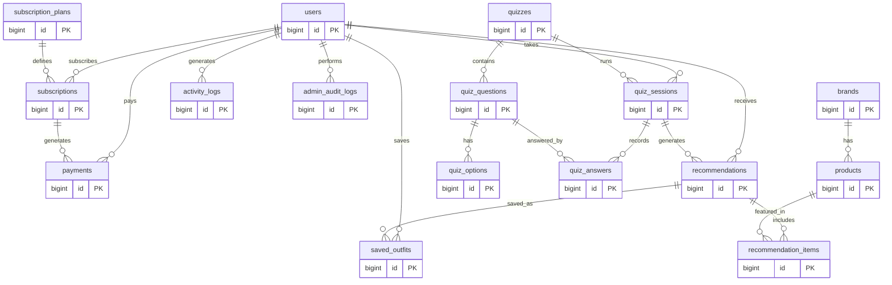
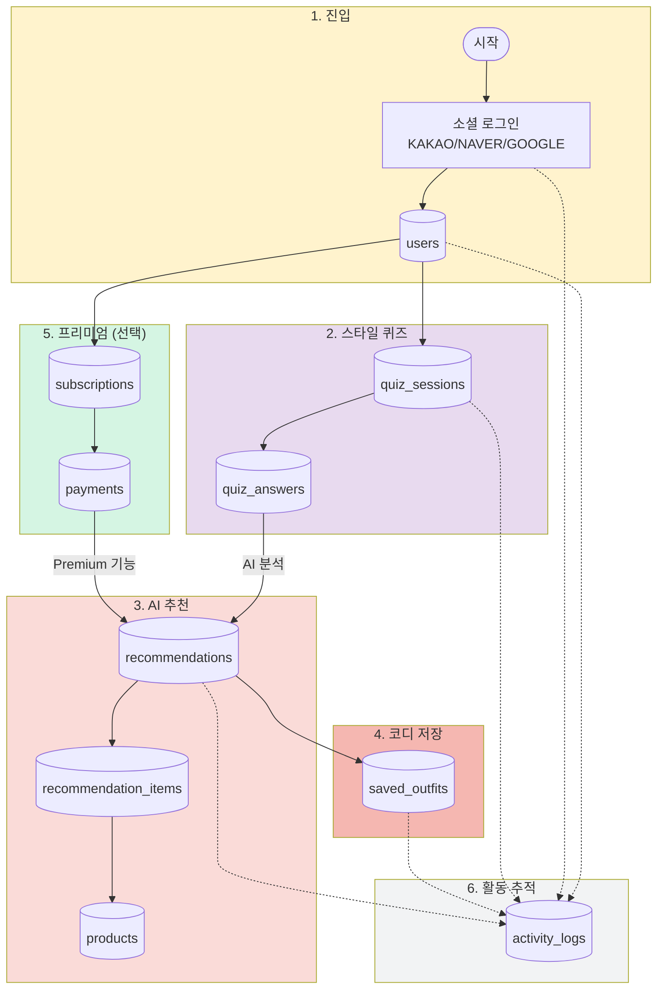
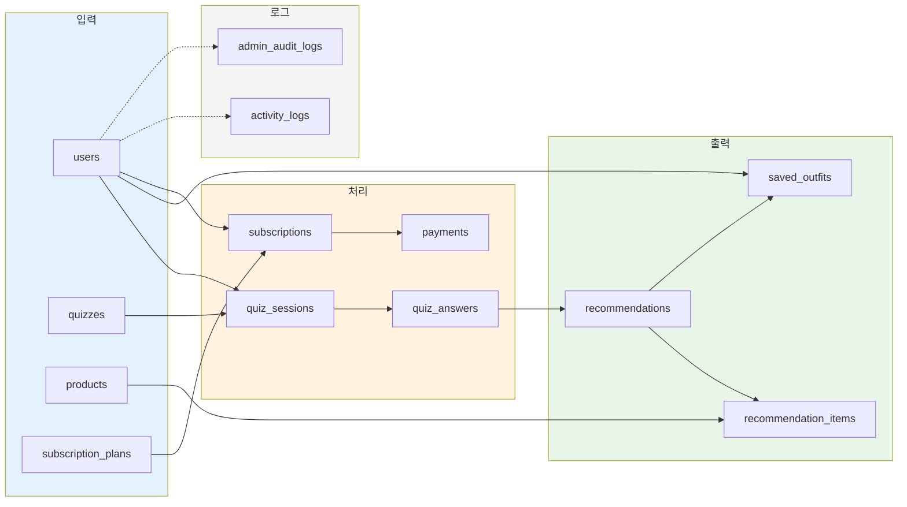

# 09. 전체 통합 플로우

## 전체 ERD 관계도

```mermaid
erDiagram
    %% User Domain
    users ||--o{ quiz_sessions : takes
    users ||--o{ subscriptions : subscribes
    users ||--o{ payments : pays
    users ||--o{ recommendations : receives
    users ||--o{ saved_outfits : saves
    users ||--o{ activity_logs : generates
    users ||--o{ admin_audit_logs : performs

    %% Quiz Domain
    quizzes ||--o{ quiz_questions : contains
    quiz_questions ||--o{ quiz_options : has
    quizzes ||--o{ quiz_sessions : runs
    quiz_sessions ||--o{ quiz_answers : records
    quiz_questions ||--o{ quiz_answers : answered_by

    %% Product Domain
    brands ||--o{ products : has

    %% Subscription Domain
    subscription_plans ||--o{ subscriptions : defines
    subscriptions ||--o{ payments : generates

    %% Recommendation Domain
    quiz_sessions ||--o{ recommendations : generates
    recommendations ||--o{ recommendation_items : includes
    products ||--o{ recommendation_items : featured_in
    recommendations ||--o{ saved_outfits : saved_as

    users { bigint id PK }
    quizzes { bigint id PK }
    quiz_questions { bigint id PK }
    quiz_options { bigint id PK }
    quiz_sessions { bigint id PK }
    quiz_answers { bigint id PK }
    brands { bigint id PK }
    products { bigint id PK }
    subscription_plans { bigint id PK }
    subscriptions { bigint id PK }
    payments { bigint id PK }
    recommendations { bigint id PK }
    recommendation_items { bigint id PK }
    saved_outfits { bigint id PK }
    activity_logs { bigint id PK }
    admin_audit_logs { bigint id PK }
```

## 사용자 여정 플로우

```mermaid
flowchart TB
    subgraph 진입["1. 진입"]
        START([시작]) --> LOGIN[소셜 로그인<br/>KAKAO/NAVER/GOOGLE]
        LOGIN --> U[(users)]
    end

    subgraph 퀴즈["2. 스타일 퀴즈"]
        U --> QS[(quiz_sessions)]
        QS --> QA[(quiz_answers)]
    end

    subgraph 추천["3. AI 추천"]
        QA -->|AI 분석| R[(recommendations)]
        R --> RI[(recommendation_items)]
        RI --> P[(products)]
    end

    subgraph 저장["4. 코디 저장"]
        R --> SO[(saved_outfits)]
    end

    subgraph 구독["5. 프리미엄 (선택)"]
        U --> S[(subscriptions)]
        S --> PAY[(payments)]
        PAY -->|Premium 기능| R
    end

    subgraph 로깅["6. 활동 추적"]
        U -.-> AL[(activity_logs)]
        LOGIN -.-> AL
        QS -.-> AL
        R -.-> AL
        SO -.-> AL
    end

    style 진입 fill:#fff3cd
    style 퀴즈 fill:#e8daef
    style 추천 fill:#fadbd8
    style 저장 fill:#f5b7b1
    style 구독 fill:#d5f5e3
    style 로깅 fill:#f2f3f4
```

## 데이터 흐름 요약

```mermaid
flowchart LR
    subgraph INPUT["입력"]
        U[users]
        Q[quizzes]
        P[products]
        SP[subscription_plans]
    end

    subgraph PROCESS["처리"]
        QS[quiz_sessions]
        QA[quiz_answers]
        S[subscriptions]
        PAY[payments]
    end

    subgraph OUTPUT["출력"]
        R[recommendations]
        RI[recommendation_items]
        SO[saved_outfits]
    end

    subgraph LOG["로그"]
        AL[activity_logs]
        AAL[admin_audit_logs]
    end

    U --> QS
    Q --> QS
    QS --> QA
    QA --> R
    P --> RI
    R --> RI
    R --> SO
    U --> SO

    U --> S
    SP --> S
    S --> PAY

    U -.-> AL
    U -.-> AAL

    style INPUT fill:#E3F2FD
    style PROCESS fill:#FFF3E0
    style OUTPUT fill:#E8F5E9
    style LOG fill:#F5F5F5
```
