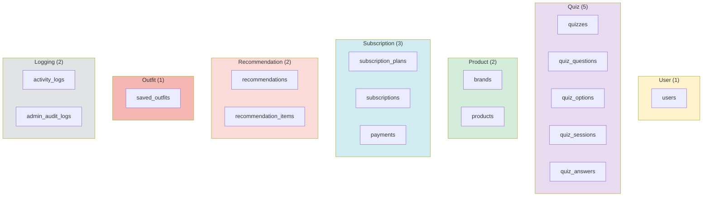

# 10. 요약

## 테이블 목록 (16개)



## 관계 매트릭스

| From \ To | users | quizzes | quiz_q | quiz_o | quiz_s | quiz_a | brands | products | sub_p | subs | pay | recom | recom_i | saved | act_l | admin_l |
|-----------|:-----:|:-------:|:------:|:------:|:------:|:------:|:------:|:--------:|:-----:|:----:|:---:|:-----:|:-------:|:-----:|:-----:|:-------:|
| **users** | - | | | | FK | | | | | FK | FK | FK | | FK | FK | FK |
| **quizzes** | | - | | | FK | | | | | | | | | | | |
| **quiz_questions** | | FK | - | | | FK | | | | | | | | | | |
| **quiz_options** | | | FK | - | | | | | | | | | | | | |
| **quiz_sessions** | FK | FK | | | - | | | | | | | FK | | | | |
| **quiz_answers** | | | FK | | FK | - | | | | | | | | | | |
| **brands** | | | | | | | - | | | | | | | | | |
| **products** | | | | | | | FK | - | | | | | FK | | | |
| **subscription_plans** | | | | | | | | | - | | | | | | | |
| **subscriptions** | FK | | | | | | | | FK | - | | | | | | |
| **payments** | FK | | | | | | | | | FK | - | | | | | |
| **recommendations** | FK | | | | FK | | | | | | | - | | | | |
| **recommendation_items** | | | | | | | | FK | | | | FK | - | | | |
| **saved_outfits** | FK | | | | | | | | | | | FK | | - | | |
| **activity_logs** | FK | | | | | | | | | | | | | | - | |
| **admin_audit_logs** | FK | | | | | | | | | | | | | | | - |

## 플로우 요약

| # | 플로우명 | 주요 테이블 | 설명 |
|---|----------|-------------|------|
| 1 | 도메인 분류 | 전체 16개 | 색상별 도메인 구분 |
| 2 | 비즈니스 흐름 | users 중심 | 5개 핵심 플로우 |
| 3 | 퀴즈 | quizzes → quiz_answers | 스타일 진단 |
| 4 | 구독/결제 | subscription_plans → payments | 프리미엄 기능 |
| 5 | 상품 | brands → products | 카탈로그 관리 |
| 6 | AI 추천 | quiz_sessions → recommendation_items | 코디 추천 |
| 7 | 저장 | users + recommendations → saved_outfits | 북마크 |
| 8 | 로깅 | activity_logs, admin_audit_logs | 추적/감사 |
| 9 | 통합 | 전체 | 전체 관계도 |
| 10 | 요약 | 전체 | 이 문서 |

## 핵심 쿼리 패턴

### 사용자의 최근 추천 조회

```sql
SELECT r.*, ri.*, p.name, p.image_url
FROM recommendations r
JOIN recommendation_items ri ON r.id = ri.recommendation_id
JOIN products p ON ri.product_id = p.id
WHERE r.user_id = :userId
ORDER BY r.created_at DESC
LIMIT 10;
```

### 퀴즈 응답 기반 스타일 분석

```sql
SELECT qa.selected_options, qo.value, qq.text
FROM quiz_answers qa
JOIN quiz_options qo ON qo.question_id = qa.question_id
JOIN quiz_questions qq ON qq.id = qa.question_id
WHERE qa.session_id = :sessionId;
```

### 사용자의 저장된 코디 목록

```sql
SELECT so.*, r.style, r.occasion, r.total_price
FROM saved_outfits so
JOIN recommendations r ON so.recommendation_id = r.id
WHERE so.user_id = :userId
ORDER BY so.saved_at DESC;
```

### 활성 구독 확인

```sql
SELECT s.*, sp.name as plan_name, sp.features
FROM subscriptions s
JOIN subscription_plans sp ON s.plan_id = sp.id
WHERE s.user_id = :userId
  AND s.status = 'ACTIVE'
  AND s.end_date > CURRENT_TIMESTAMP;
```

## 기술 스택

| 구분 | 기술 |
|------|------|
| Database | PostgreSQL 15+ |
| ORM | JPA/Hibernate |
| Framework | Spring Boot 3.x |
| 특수 타입 | JSONB, Array |
| 인덱스 | B-Tree, GIN (tags) |
